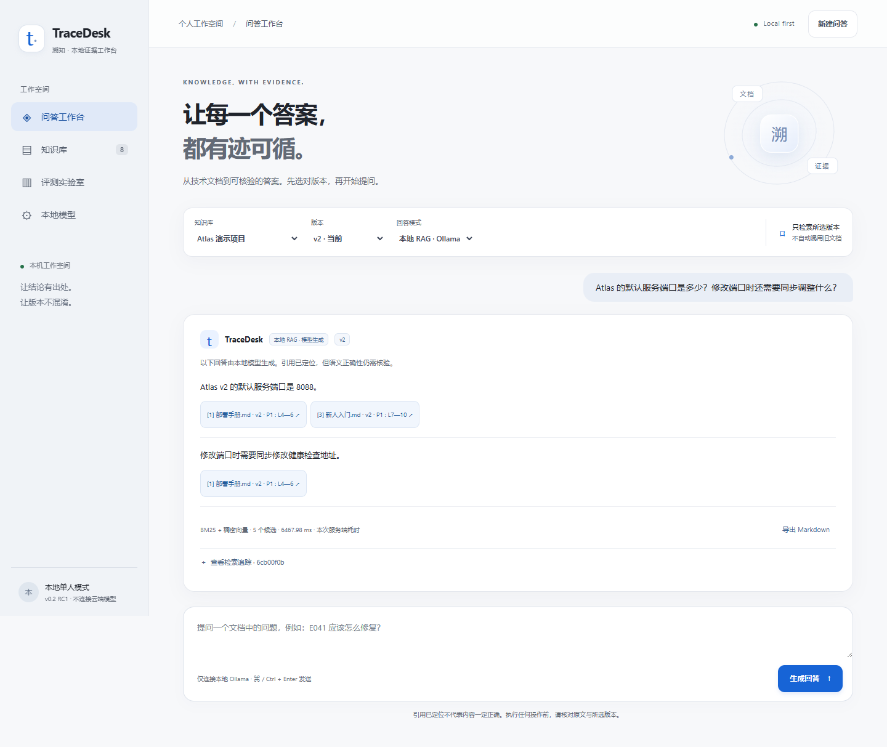

# TraceDesk · 溯知

面向技术文档交接的本地RAG工作台。按知识库和版本查找资料，生成带原文引用的回答，并在资料不足或引用失败时明确提示。

当前已发布的预发布版本为 **0.2.0rc2**，面向可复现的本地单人部署。后端使用FastAPI与SQLite，网页为原生HTML/CSS/JavaScript；历史单人回归使用Ollama，正式团队部署改用vLLM的OpenAI兼容服务。复杂论文问答仍存在实质性错误，继续保持预发布状态。



## 能做什么

- 导入Markdown、UTF-8 TXT和文本型PDF，按标题、页面与文本行分块。
- 按知识库和版本限定范围，支持同名文档替换、删除和索引失效处理。
- 比较BM25、向量检索与RRF混合检索，使用本地模型生成回答。
- 模型选择本轮来源编号，后端构造精确原文引用；点击引用查看文件、版本、页与解析行。
- 逐项查找问题所需事实，有必要事实缺失时统一拒答，并保留模型证据判断记录。
- 保存独立批量评测结果，分别检查证据召回、回答、拒答、引用和耗时。

## 快速开始

下载并解压[0.2.0rc2预发布安装包](https://github.com/janeblackcc-gif/TraceDesk/releases/tag/v0.2.0rc2)，或克隆本仓库。发布附件提供SHA256校验文件，模型权重需另行准备。

Windows / PowerShell 7，在项目根目录执行：

```powershell
py -3.13 -m venv .venv
./.venv/Scripts/python.exe -m pip install -r requirements.txt
./.venv/Scripts/python.exe scripts/start.py --check
./.venv/Scripts/python.exe scripts/start.py
```

打开 http://127.0.0.1:8765。先载入演示资料，在Atlas的v2范围查询默认服务端口，可定位到8088；切换v1后可定位8000。Atlas是虚构演示项目，其端口与网页地址无关。证据模式可以在没有模型或GPU的机器上运行。

## 启用本地RAG

以下是保留的Windows/Ollama兼容路径，测试版本为0.33.3。准备两个本地模型：

```powershell
ollama pull qwen3-embedding:0.6b-q8_0
ollama pull qwen3.5:4b-q4_K_M
./.venv/Scripts/python.exe scripts/start.py --check --require-models
pwsh -NoProfile -File ./start_local_rag.ps1
```

在知识库页面导入资料并建立本地向量索引，再切换到本地RAG模式。模型权重单独下载，不包含在仓库或发布包中。正式团队部署不使用这条路径，改按[工业化运维配置](docs/industrial/operations.md)启动两个受控vLLM端点，并先运行协议探针。

可使用项目根目录.env配置数据目录、端口、provider和模型，参考[配置示例](.env.example)。环境变量优先；兼容模式默认地址为http://127.0.0.1:11434，正式vLLM配置使用8000/8001两个loopback端点。端口已占用时可传入--port 8766。完整安装、Linux命令和排错见[部署文档](docs/deployment.md)。

## 评测结果

在同一12题冻结开发集上，引用协议改造前后分别执行36次真实问答。三种检索方法的Hit@4均为10/10；每种方法的引用降级由1次降为0次，可答题有效模型回答由9/10变为10/10，无答案题均正确拒答2/2。

题集由AI拟定，资料为v0.1时期的短文档快照，尚不能证明真实用户准确率或混合检索优势。已对逐题内容进行代理复核，并单独记录补充条件遗漏、冗长回答和计时限制。完整结果、方法与复跑步骤见[评测说明](docs/evaluation.md)。

RC1 的24题FastAPI外部文档挑战完成72次问答，严格通过均为13/24，见[原始报告与失败案例](docs/external-evaluation.md)。证据规划修复后的开发回归为 BM25 21/24、dense 18/24、hybrid 22/24，无答案题均正确拒答6/6；仍有引用错配和条件遗漏，运维集全文覆盖也有退步。新8题合成迁移样例按冻结标准通过6/8，包含标注局限。完整取舍见[修复回归报告](docs/grounding-repair.md)，继续保留预发布状态。

RC2依据首轮8题真实论文问题的人工评分0/8修复了跨页检索和结构化错误。最终49条hybrid开发回归均执行完成；同论文题AI复核仍仅1/8完整通过，FastAPI为19/24，历史运维按直接问题为12/12、冻结完整参考为8/12，合成公式诊断为4/5。新结果不是人工复评分，FastAPI较上一轮退步；见[RC2记录、失败与成本](docs/rc2-evaluation.md)。

## 开发与发布

工业化改造已实现 PostgreSQL 数据底座、账号与知识库权限、隔离解析、版本索引、异步问答、vLLM适配、运维工具和团队前端；
本机 readiness 检查已完成，但这些新增能力尚未作为正式团队产品发布。进度见[工业化实施状态](docs/industrial/status.md)，
验证方法见[工业化开发说明](docs/industrial/development.md)，验收汇总规则见[工程验收说明](docs/industrial/acceptance.md)。

截至 2026-09-17，Ubuntu 22.04/RTX 5090 目标 VM 已完成 Docker Compose、PostgreSQL/pgvector、隔离 parser、vLLM generation/embedding、认证浏览器、模型/数据库/worker 故障恢复、合成备份恢复和不可变双镜像回滚。T-075 正式容量门禁已通过：1,807.5 秒、50,000 active chunks、20 用户、5 并发、10 场景和 1,478 个样本，稳态错误率为 0，API/evidence/queue/RAG P95 均满足预设上限，OOM、数据损坏和越界为 0。修复版离线 dev 回归可作为带边界的开发集证据，但已消耗的 v2 holdout 因占位内容和金标不可解析被判定为基准无效，不能形成正式模型质量结论。受信任域名/TLS、真实资料规模恢复、registry 发布切换和真实用户试用仍未完成；容量结果也不得扩写为生产 SLA 或长期可用性。

```powershell
./.venv/Scripts/python.exe -m pip install -r requirements-dev.txt
./.venv/Scripts/python.exe -m pytest -q
./.venv/Scripts/python.exe scripts/release_check.py
```

代码结构见[架构说明](docs/architecture.md)，参与开发见[贡献说明](CONTRIBUTING.md)，版本进度见[验收清单](docs/release-plan.md)与[更新记录](CHANGELOG.md)。团队模式的部署、备份和升级边界见[运维配置](docs/industrial/operations.md)。

## 边界

RC2 兼容路径仍是单 worker、本机回环和单人模式；团队模式提供账号与知识库权限，但需要 PostgreSQL、TLS 和独立 worker，尚未完成目标环境发布验收。文件上限10 MiB，PDF最多100页；不支持扫描件OCR和加密PDF。较大的知识库、复杂提示注入、真实用户任务及不同GPU仍需专门验证。

跨语言检索扩展有助于补充证据，但不保证模型正确理解公式、表格和算法范围。论文复现需要回到原文逐项核对，不应直接采用本版生成的算法步骤或复杂度推导。

引用位置与原文匹配不能证明结论语义正确。没有依据时应拒答，引用失败时会显示原文摘录降级。SQLite与本地记录未加密，请自行管理资料权限与备份。

项目起始实现由AI辅助生成，公开仓库保留代码、测试、数据来源和可核查的迭代证据。采用[MIT许可证](LICENSE)；第三方模型、依赖和用户导入资料遵循各自许可。

[GitHub仓库](https://github.com/janeblackcc-gif/TraceDesk) · [自动化测试](https://github.com/janeblackcc-gif/TraceDesk/actions)
