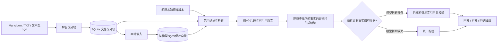

# 架构与约束

TraceDesk是本地技术文档问答工具。用户显式选择知识库和版本，系统在所选范围中检索，再给出模型回答或原文摘录。

## 模块

| 文件 | 职责 |
|---|---|
| app/config.py | 项目配置、环境优先级、本机地址约束 |
| app/ingest.py | 格式、大小、编码检查，按标题和文本行分块 |
| app/store.py | SQLite存储、版本范围、文档生命周期与向量 |
| app/retrieval.py | BM25、向量余弦相似度与RRF融合 |
| app/providers.py | Ollama嵌入、受约束生成与模型状态 |
| app/citations.py | 本轮来源编号及原文引用构造 |
| app/service.py | 问答编排、最终引用校验、拒答与降级 |
| app/main.py | HTTP接口、请求限制、单人操作锁和静态网页 |
| app/batch_evaluation.py | 输入验证、只读索引快照与分层评测 |

## 索引与生命周期

文档身份由知识库、版本、文件名和内容哈希确定。相同内容重复导入保持幂等；同范围同名内容变化时，替换文档并清理旧分块和向量。查询前按知识库、版本及ready状态过滤。

向量键包含嵌入模型标签与digest。模型变化后不会使用旧模型的索引。每批最多嵌入8个分块，只有当前模型下缺失的分块需要计算。当前实现采用精确向量扫描，适用于小型单人语料；大规模检索需要先测量瓶颈再选择索引设施。

## 引用协议

检索最多返回5个候选，生成只接收前4个。每个候选被整理成带本轮source_id的连续原文段，优先使用换行边界，每段满足最终8至600字符的引用约束。

模型按子问题输出所需事实、source_ids、简短证据判断、supported和answer，先选依据再写结论。后端严格校验结构、布尔类型及字段一致性；只要一项必要事实缺失，就返回abstain=true、claims=[]。目前采用整问拒答，不输出部分答案；拆分提问可分别查询有依据的部分。

全部事实齐备时，后端从本轮映射恢复chunk_id和原文quote，随后仍由Service.validate_claims检查来源归属、长度和连续逐字匹配。不允许模型自行编写quote。本轮映射中不存在的编号触发原文摘录降级；结构不合法、请求失败或输出截断返回明确的模型执行错误。编号可在不同请求中重复，解析始终使用当前请求的映射。

仍只有一次生成调用。generation_assessment记录模型判断的决策、所需事实数、缺失事实和生成耗时，随响应、trace及Markdown导出保留。该字段不代表独立审核或事实验证；模型仍可能漏拆子问题、误判证据或遗漏限定条件。

这个机制处理模型抄写引用时改动空格的问题。它不证明生成结论在语义上得到原文支持；错误结论仍可能选择一个真实片段，因此必须保留语义评测和无依据拒答。

## 配置与运行

每个进程按环境变量、项目.env、默认值的顺序读取配置，数据目录基于项目根目录解析。模型服务仅允许本机HTTP地址，网页绑定127.0.0.1，使用单个worker和串行操作锁。

数据库和原始问答记录留在本机数据与实验目录；公开报告通过独立导出收录已核对的示例数据。暂未实现账号、跨用户权限、OCR、长期对话记忆和跨版本自动合并。
