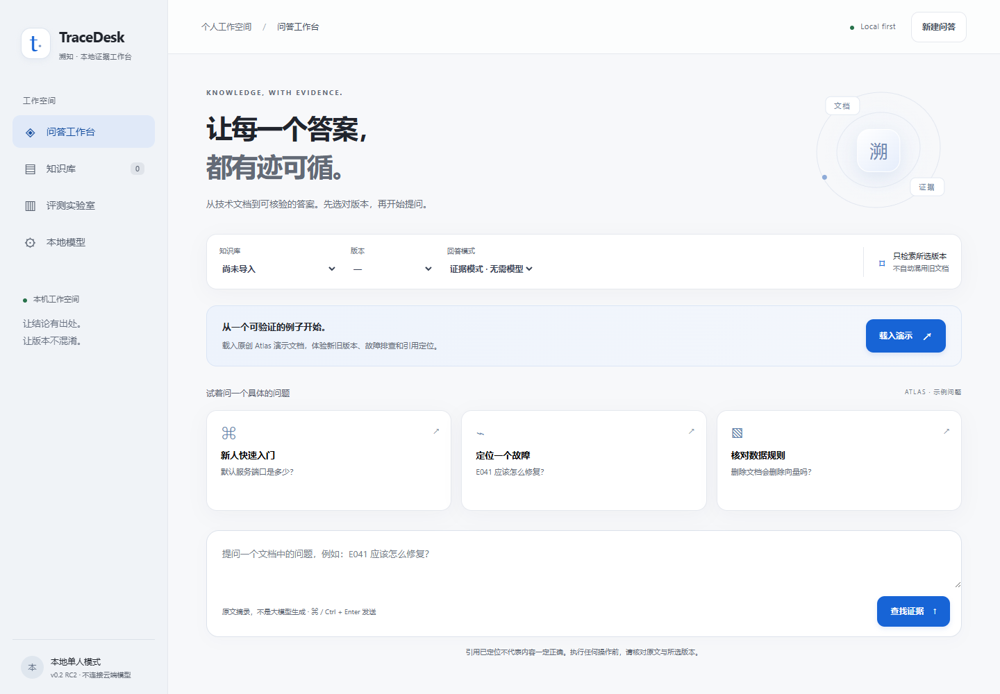
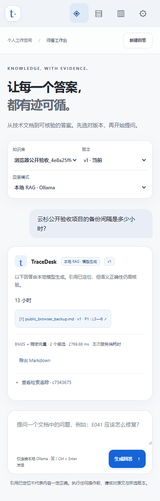

# RC2安装与浏览器验收

2026-09-09，在新的解压目录创建Python 3.13.14虚拟环境，安装锁定依赖，pip check、启动诊断及179项pytest全部通过。模型服务为Ollama 0.33.3，两个模型标签与[RC2评测](../../rc2-evaluation.md)一致。

后端运行本次解压包，使用全新空数据库；浏览器客户端复用已有Playwright 1.62.0及Microsoft Edge。真实HTTP页面导航、表单和浏览器请求均未使用响应桩、页面注入或代理桥接。

完整验收为38项功能检查通过，涵盖8份演示文档、v1/v2隔离、7小时到13小时的文档替换和重建索引、缺失电话拒答、逐字引用高亮、生成记录在响应/追踪/Markdown导出中的一致性，以及删除后的来源失效。38项中也包含截图和布局断言，不能当作38个独立语义任务。[完整报告](report.json)保留逐项结果，浏览器页面、控制台与网络错误均为空。

首次尝试因测试客户端缺少可选Playwright依赖而在浏览器启动前退出，未进行功能验收；复用现有测试环境后完成上述运行。全流程截图发现页脚仍为RC1，随后仅将web/index.html中的版本文字改为RC2；[目标检查](footer-report.json)确认服务HTML与修正文件逐字节相同、后端0.2.0rc2与可见页脚RC2一致，没有重跑模型问答或更改应用逻辑。

手机图来自完整38项检查，首页图来自后续版本文字检查。手机视口模拟不代表实体设备或其他浏览器引擎验证；短合成数字题通过也不代表算法论文语义质量通过。测试结束后已停止该次验收的独立网页进程。
