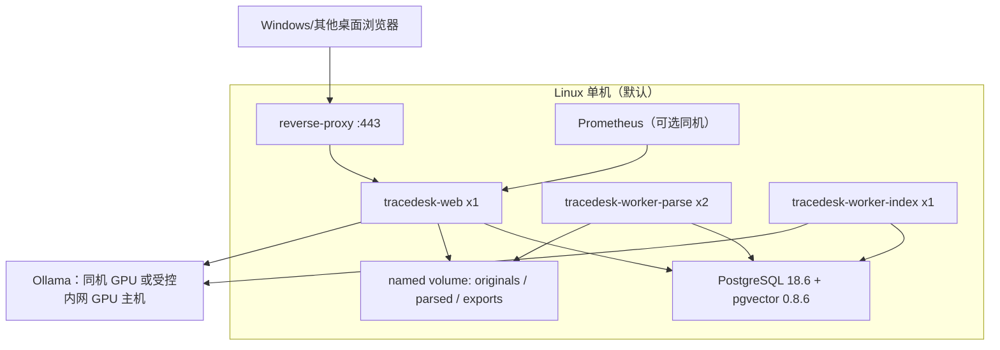
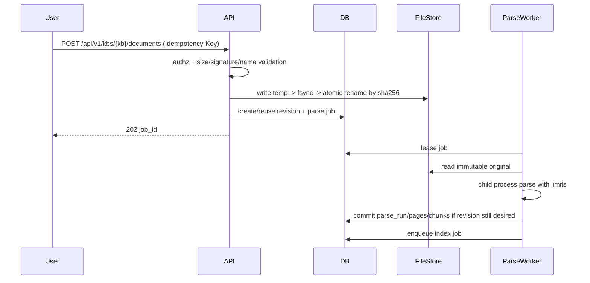

# TraceDesk 架构与关键决策

## 1. 目标架构：模块化单体 + 独立 Worker

不采用微服务/Kubernetes作为工业化证明。默认一台 Linux 主机上部署：

```mermaid
flowchart LR
  B[Browser] --> RP[HTTPS Reverse Proxy]
  RP --> API[FastAPI Web/API]
  API --> PG[(PostgreSQL 18 + pgvector)]
  API --> FS[(Original File Store)]
  API --> M[Ollama Model Service]
  W1[Parse Worker] --> PG
  W1 --> FS
  W2[Index Worker] --> PG
  W2 --> M
  W3[Eval Worker] --> PG
  API --> PG
  OBS[Prometheus / Logs / OTel] <-- API
  OBS <-- W1
  OBS <-- W2
```

代码仍是一个仓库、一个领域模型；Web 与 worker 共享 `domain/`、`repositories/`、`services/`，只在进程边界上隔离长任务和危险解析。

## 2. 建议部署图



若 Ollama 在另一主机，必须是受控内网地址并配置显式 allowlist/TLS 或可信网络隧道；当前 `config.py` 的 localhost-only 限制要由“模型服务信任边界配置”替代，而不是直接删除安全约束。

## 3. 当前模块到目标模块

| 当前 | 目标 | 处理 |
|---|---|---|
| `app/config.py` | `app/core/config.py` | 保留环境优先原则；增加 DB、storage、auth、limits、observability |
| `app/store.py` | `app/db/models.py` + `repositories/*` | 替换单类 SQLite Store；业务事务移入 service |
| `app/ingest.py` | `app/parsing/validators.py` + worker parser | 保留输入规则；PDF 解析移出 Web |
| `app/retrieval.py` | `app/rag/retrieval.py` | 保留 tokenize/RRF 作为可回归基线；底层改 PG FTS + pgvector |
| `app/providers.py` | `app/models/ollama.py` | 保留结构化输出和引用 source-id 协议；加入超时/取消/指标 |
| `app/citations.py` | `app/rag/citations.py` | **核心不变量保留**：模型不自行提供 quote |
| `app/service.py` | `app/services/query_service.py` 等 | 拆按用例，不拆成网络微服务 |
| `app/main.py` | `app/api/v1/*` | 新 `/api/v1`；旧接口兼容期只读/代理 |
| `app/batch_evaluation.py` | `app/eval/*` | 保留冻结与 hash；增加真实标注 schema |
| `web/*` | `web/*` | 渐进增强；加入登录、任务、权限、过期索引状态 |

“拟新增”路径详见 06 号任务清单；它们当前不存在。

## 4. 核心时序

### 上传/替换


### 索引与原子切换
```mermaid
sequenceDiagram
  participant W as IndexWorker
  participant D as DB
  participant M as Model
  W->>D: lease index job(revision_id,index_generation_id)
  W->>M: embed batches
  W->>D: write embeddings to non-active generation
  W->>D: validate counts/dims/model digest
  W->>D: CAS: desired_revision==revision AND not deleted
  alt CAS success
    D->>D: mark generation ready + switch active
  else superseded/deleted
    D->>D: generation superseded; never active
  end
```

### 查询
`auth → resolve KB permission → resolve active revision/index generation → lexical+dense retrieval → bounded context → generation → exact citation materialization → authorization epoch recheck → response/trace`。

### 删除
`DELETE → permission → set deleted_at/tombstone + increment auth/data epoch → cancel queued jobs → running jobs see cancel/superseded → active index detached → async GC after retention`。删除事务完成后查询面立即不可见。

## 5. 技术栈决策

### 数据库：SQLite → PostgreSQL 18.6
**选择**：PostgreSQL 18.6 + SQLAlchemy 2.0.52 + Psycopg 3 + Alembic 1.19.2。  
**解决**：并发事务、行锁、`SKIP LOCKED` 队列、版本化迁移、FTS、备份工具、权限数据一致性。  
**不选**：继续 SQLite 作为团队生产库，因为当前全局锁、迁移与并发目标已超过单文件数据库的默认舒适区。  
**代价**：多一个长期运行服务、备份和升级责任。  
**扩容触发**：DB CPU/IO 持续成为 P95 瓶颈、单机容量接近预算或需要 HA 时，再评估托管/主从，不提前分布式。

### 全文与向量：PostgreSQL FTS + pgvector 0.8.6
默认在同库保存 `tsvector` 与 `vector(1024)`。先保留 exact dense 查询用于 ≤50k chunk 的基准；若 M8 证明 P95 不达标，再启用 HNSW。HNSW 会牺牲部分召回，必须用冻结集比较 exact vs ANN 后放行。pgvector 官方明确支持 HNSW/IVFFlat及与 PostgreSQL FTS 混合。

不直接引入 Qdrant/Milvus：当前规模、单机部署与事务一致性更需要“文档/权限/索引同事务可判断”。触发条件：>200k–500k 活跃向量、ANN 成为主要瓶颈且 PostgreSQL 调优后仍不达 SLO，才做替换 ADR。

### 后台任务：PostgreSQL jobs 表 + `FOR UPDATE SKIP LOCKED`
不引入 Redis/Celery。worker 领取短事务，写 `lease_owner/lease_expires_at/heartbeat_at`；执行期间不持有 DB 行锁。PostgreSQL 官方明确指出 `SKIP LOCKED` 适合 queue-like 多消费者。  
触发外部队列条件：任务吞吐、跨语言 worker、跨区域或队列本身成为 DB 压力源。

### 模型服务：继续 Ollama Provider
保留当前已验证的 `/api/embed`、结构化 JSON schema、`temperature=0` 和 source-id 引用恢复。新增 provider interface，但首批只启用 `ollama_local`。模型标签、digest、embedding dimension、prompt version 都进入 `model_profiles/index_generations/query_runs`。任何 provider 失败都不得静默切换到另一模型/云端。

### 原文件存储：本机持久卷对象目录
默认 `data/objects/sha256/ab/<digest>`，DB 只保存 object key、大小、hash、MIME/检测结果。原文件不可直接由静态服务器暴露；下载必须经授权 API。  
不默认上 MinIO/S3：单机 20GB 范围不需要额外服务。触发条件：多机、对象>100GB、需要对象版本/远端备份时改为 S3-compatible repository。

### 认证：本地账号 + 服务端会话
默认 Argon2id 密码哈希；随机高熵 session token 只存 hash，浏览器 Cookie `HttpOnly; Secure; SameSite=Lax/Strict`，服务端可立即撤销。选择 session 而不是长期 JWT，是因为首批同源 Web 需要权限撤销即时生效。  
若组织已有 OIDC，替换登录入口但保留内部 `user/workspace/kb membership` 授权模型。

### 监控：结构化日志 + Prometheus + OpenTelemetry
Web/worker 统一 request_id/job_id/trace_id；指标覆盖请求、队列、任务、解析、检索、模型、DB、资源。日志不写原文、quote、密码、token、session、数据库连接串；问题正文默认只在业务 trace 表按权限和保留策略保存，不进入普通日志。

## 6. API 与兼容策略

新接口统一 `/api/v1`。RC2 旧接口保留一个迁移周期：
- GET 类可代理到 v1；
- 写接口返回 `Deprecation`/文档提示并仍执行权限；
- 新的团队部署默认 UI 只调用 v1；
- 当所有客户端和导出格式迁移后删除旧写接口。

旧 `doc_id`/`chunk_id` 不丢失：迁移时存 `legacy_id` 并建立 alias resolver。新内部主键使用 UUID；旧导出可通过兼容来源解析接口定位迁移后的 revision/chunk。

## 7. 安全边界

上传只允许业务需要的扩展名，验证文件签名/解析器结果，不信任浏览器 Content-Type；对象名由系统生成；文件存 Web root 外；解析在低权限子进程，设置墙钟、CPU、内存和临时目录上限。可选 ClamAV 是增强项，不把“扫描通过”当作安全证明。

反向代理终止 HTTPS；应用只信任明确代理。CSRF 采用 SameSite + Origin/CSRF token 双层；所有授权服务端执行。管理员、权限变更、上传、删除、导出和安全拒绝写审计。

## 8. 版本基线与官方来源（2026-09-09 核验）

- PostgreSQL 18.6：https://www.postgresql.org/docs/18/
- PostgreSQL queue locking：https://www.postgresql.org/docs/18/sql-select.html
- PostgreSQL FTS：https://www.postgresql.org/docs/18/textsearch.html
- pgvector 0.8.6：https://github.com/pgvector/pgvector
- SQLAlchemy 2.0.52：https://docs.sqlalchemy.org/en/20/
- Alembic 1.19.2：https://alembic.sqlalchemy.org/en/latest/
- Ollama Embed：https://docs.ollama.com/api/embed
- Ollama Structured Outputs：https://docs.ollama.com/capabilities/structured-outputs
- OWASP Password Storage / Session / File Upload / Logging：对应 Cheat Sheet Series
- Docker Compose health dependency：https://docs.docker.com/compose/how-tos/startup-order/

执行时只允许升级到经 CI/迁移/模型 smoke 验证的新稳定补丁版本；不得把基础依赖升级和业务功能修改混在同一 PR。
