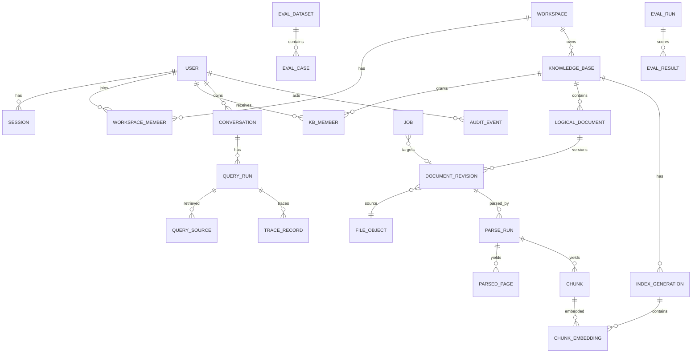

# TraceDesk 数据模型、迁移与恢复

## 1. 设计原则

1. 原文件、解析结果、chunk、embedding、索引代次分层，不再把“文档”压成一行 JSON pages。
2. revision 不可变；替换创建新 revision，活动指针原子切换。
3. 所有可见查询都通过 workspace/KB 权限和 active generation。
4. 旧 RC2 ID 不丢失；新主键与 legacy alias 分离。
5. schema 迁移与大数据搬迁分开：Alembic 管结构，小心的数据 backfill 使用独立可重复脚本。
6. 删除首先改变可见性，再异步 GC；任务提交必须 CAS 检查 tombstone/desired revision。

## 2. 实体关系



## 3. 关键表（字段为实施契约）

### users
`id uuid PK`, `email citext UNIQUE`, `display_name varchar(120)`, `password_hash text nullable`, `status enum(active,disabled)`, `auth_version bigint default 1`, `created_at timestamptz`, `last_login_at`.

### sessions
`id uuid PK`, `user_id FK`, `token_hash bytea UNIQUE`, `created_at`, `expires_at`, `last_seen_at`, `revoked_at`, `auth_version_at_issue`. 原始 session token 不入库/日志。

### workspaces / workspace_members
workspace：`id`, `name`, `slug UNIQUE`, `created_at`.  
member：`workspace_id,user_id,role enum(admin,member)`, 复合 PK。

### knowledge_bases / kb_members
KB：`id`, `workspace_id FK`, `name`, `slug`, `active_index_generation_id nullable`, `data_epoch bigint default 1`, `deleted_at`; `UNIQUE(workspace_id,slug)`。  
KB member：`kb_id,user_id,role enum(editor,viewer)`；workspace admin 隐式拥有全部权限。

### logical_documents
`id uuid PK`, `kb_id FK`, `display_name`, `normalized_key`, `desired_revision_id nullable`, `active_revision_id nullable`, `deleted_at`, `created_by`, `created_at`; `UNIQUE(kb_id,normalized_key) WHERE deleted_at IS NULL`。

### file_objects
`id uuid`, `sha256 char(64) UNIQUE`, `size_bytes bigint`, `storage_key text UNIQUE`, `detected_type`, `original_extension`, `created_at`, `ref_count`（可由查询计算，不依赖它做唯一真值）。

### document_revisions
`id uuid`, `document_id FK`, `revision_no int`, `file_object_id FK`, `sha256`, `status enum(uploaded,parsing,parsed,indexing,ready,failed,superseded,deleted)`, `parser_profile`, `created_by`, `created_at`, `activated_at`, `deleted_at`, `legacy_doc_id varchar(64) nullable UNIQUE`; `UNIQUE(document_id,revision_no)`。

### parse_runs / parsed_pages / chunks
parse_run：`id`, `revision_id`, `parser_name`, `parser_version`, `config_hash`, `status`, `started_at`, `finished_at`, `error_code`, `metrics jsonb`。  
page：`id`, `parse_run_id`, `page_no int`, `text text`, `text_sha256`, `metadata jsonb`, `UNIQUE(parse_run_id,page_no)`。  
chunk：`id uuid`, `parse_run_id`, `revision_id`, `ordinal int`, `page_start/page_end`, `line_start/line_end`, `heading`, `text`, `text_sha256`, `token_count nullable`, `legacy_chunk_id nullable UNIQUE`; `UNIQUE(parse_run_id,ordinal)`。

### model_profiles / index_generations / chunk_embeddings
model_profile：`id`, `provider`, `model_tag`, `model_digest`, `dimension`, `prompt/input_profile`, `created_at`; `UNIQUE(provider,model_digest,input_profile)`。  
index_generation：`id`, `kb_id`, `model_profile_id`, `retrieval_config_hash`, `status enum(building,ready,active,superseded,failed)`, `corpus_manifest_hash`, `chunk_count`, `created_at`, `activated_at`; 同一 KB 只能一个 active（partial unique index）。  
embedding：`generation_id`, `chunk_id`, `embedding vector(1024)`, `created_at`; PK `(generation_id,chunk_id)`。如未来维度改变，不直接混在同一 typed column；新建对应 embedding table/version 或经迁移改变 schema，禁止“vector 任意维度 + 靠运行时猜”。

FTS：`chunks.search_tsv tsvector` 由解析后的 heading/filename/text 生成，GIN 索引；中文检索仍保留当前 bigram/tokenizer 逻辑作为应用侧 sparse channel，直到中文 FTS 方案在真实集证明更好。

### jobs / job_attempts
job：`id uuid`, `type`, `workspace_id`, `kb_id`, `revision_id nullable`, `generation_id nullable`, `state`, `priority`, `idempotency_key`, `payload jsonb`, `attempt_count`, `max_attempts`, `available_at`, `lease_owner`, `lease_expires_at`, `heartbeat_at`, `cancel_requested_at`, `result jsonb`, `error_code`, `created_by`, timestamps；`UNIQUE(type,idempotency_key)`。  
attempt：`id`, `job_id`, `attempt_no`, `worker_id`, `started_at`, `finished_at`, `outcome`, `error_code`, `metrics jsonb`。

### conversation/query/trace
conversation：`id`, `user_id`, `kb_id`, `created_at`, `last_activity_at`, `deleted_at`。  
query_run：保存 `question`（业务数据，受权限/保留控制）、scope、active revision/index generation、model profile、retrieval config、status、latencies、auth_version/data_epoch 快照。  
query_source：`query_run_id,chunk_id,rank,channel,score,context_origin`。  
trace_record：只存可复现的结构化技术字段，不存隐藏思维链；普通日志不复制 question/quote。

### audit_events
`id bigserial`, `occurred_at`, `actor_user_id`, `workspace_id`, `kb_id`, `action`, `resource_type/id`, `outcome`, `request_id`, `metadata jsonb`。metadata 只允许白名单字段，不含原文、token、session、密码。

### evaluation
dataset：名称、版本、冻结 hash、provenance、status(dev/holdout)。  
case：question、scope、task_type、answerability、required_facts、gold_passages、severity。  
run：code commit、dataset hash、corpus manifest、model digest、prompt/retrieval config hash。  
result：retrieved ids、generation ids、自动指标、人工评分、reviewer ids、dispute status。

## 4. 索引与约束

必须至少建立：
- 所有 FK 对应索引；
- `logical_documents(kb_id, normalized_key)`；
- `document_revisions(document_id, revision_no desc)`；
- `chunks(revision_id, ordinal)`、GIN `search_tsv`；
- `chunk_embeddings(generation_id, chunk_id)`；HNSW 仅在容量测试触发后建；
- `jobs(state, available_at, priority, created_at)`，以及 lease 过期查询索引；
- `audit_events(workspace_id, occurred_at desc)`；
- `query_runs(user_id, created_at desc)`；
- partial unique：每 KB 仅一个 `index_generation.status='active'`。

所有时间使用 UTC `timestamptz`；枚举可用 CHECK/数据库 enum，但状态迁移必须在领域层集中定义。

## 5. SQLite → PostgreSQL 迁移

### 5.1 旧 ID
- 旧 `documents.id` 保存到 `document_revisions.legacy_doc_id`；
- 旧 `chunks.id` 保存到 `chunks.legacy_chunk_id`；
- 新 API resolver 先查 UUID，再查 legacy alias；
- 旧导出被解释为“历史快照”；其中引用可通过 alias 定位到迁移后的同一文本。如果旧文档后来被替换/删除，resolver 返回 `410 Gone` + 历史元数据，而不是错误指向新内容。

### 5.2 旧 collection/version 映射
默认创建一个 workspace：`Migrated Local Workspace`，owner 为执行迁移时指定的 bootstrap admin。每个旧 collection → 一个 KB；旧 version 作为 `document_revision.source_version_label`（拟新增字段）保留。由于当前数据模型允许同 collection 多 version 同时存在，而新模型把 KB 的活动语料显式化，迁移为每个 `(collection,version)` 创建一个 **KB snapshot scope** 是最安全默认：KB 名 `collection / version`，避免迁移时擅自合并版本。真实团队随后可通过管理工具重组，不自动跨版本合并。

若产品负责人要求继续一个 KB 内多“版本范围”，应在 M1 前改变 schema；不能在迁移脚本里临时猜。

### 5.3 旧向量
读取旧 `vectors.model_key`；只有能解析出当前模型 digest、维度一致且 chunk 文本 hash 一致的向量才迁入一个 `index_generation(status=ready)`。无法证明 digest/维度/输入 profile 的向量只记录 manifest，不导入 active。默认更稳妥策略：**迁移文本与 legacy ID，重新建向量**；旧向量仅用于迁移校验，不作为生产 active。

### 5.4 旧 conversations/traces
旧 conversations 只有 last_question 且无用户身份，默认不迁入用户会话。旧 traces 可能含问题文本，默认导出为受限迁移归档 JSON，保留 30 天供核对；不绑定到任意普通用户。需要保留时由管理员显式导入 audit archive。

## 6. 迁移执行流程

1. **冻结写入**：旧 RC2 进入只读维护窗口。
2. **备份**：复制完整 SQLite DB + `-wal/-shm`（若存在），计算 SHA-256；保存源码版本、模型配置。
3. **dry-run**：只读扫描表、行数、孤儿 FK、重复 legacy ID、文档/页/chunk hash、向量维度/model_key；生成 `migration_plan.json`，不写目标库。
4. **建目标 schema**：`alembic upgrade head`；记录 revision。
5. **导入 identity/workspace/KB**：bootstrap admin 必须由真实操作者提供，不能自动伪造用户。
6. **导入 document/file/page/chunk**：每批事务 100–500 行；原文件缺失是现状事实，迁移时把旧 `pages` JSON 生成 `legacy_extracted_text` 对象，并标 `source_file_available=false`。不得伪造原 PDF。
7. **向量策略**：默认 enqueue reindex；不把旧 JSON 向量直接 active。
8. **校验**：数量、legacy ID、文本 hash、随机/全量引用定位、每 scope 候选数。
9. **切换前备份**：目标 PostgreSQL + object store 做首次备份。
10. **启动新服务只读 smoke**：旧 ID resolver、library、source、证据模式。
11. **开启写入**；旧 RC2 保持离线可回滚副本直到 M8。

## 7. dry-run 输出最少字段

```json
{
  "source_db_sha256": "...",
  "source_counts": {"collections": 0, "documents": 0, "chunks": 0, "vectors": 0},
  "issues": [{"code": "MISSING_ORIGINAL_FILE", "doc_id": "..."}],
  "legacy_id_collisions": [],
  "vector_profiles": [{"model_key": "...", "dimension": 1024, "count": 0}],
  "planned_kbs": [],
  "reindex_required": true
}
```

dry-run 发现 orphan chunk、无法解析 JSON pages、legacy ID 冲突、文本 hash 不稳定时停止正式迁移。

## 8. 事务、幂等与失败

- 每个 source document/revision 使用 deterministic `migration_key=source_db_hash:legacy_doc_id`，目标表 unique；重复执行变为 no-op/校验，不重复创建。
- 大数据迁移不做一个超长事务；每个批次提交后写 checkpoint。失败后从 checkpoint 继续。
- schema 迁移失败：应用不启动；恢复数据库备份或执行已验证 downgrade。对不可逆数据迁移，不假装 Alembic downgrade 能恢复数据，使用备份恢复。
- 正式切流前源 SQLite 不删除。
- 恢复后必须重新执行：row counts、hash manifest、ACL、active generation、10 条冻结 smoke、legacy resolver。

## 9. 备份恢复

默认每日 PostgreSQL logical backup + 每周一次全量/物理备份（具体工具由部署环境决定），object store 每日增量/快照；两者使用同一 `backup_set_id` manifest。至少保留 7 个日备份和 4 个周备份，真实保留期由团队数据政策确认。

恢复验收不是“文件能解压”，而是：
- schema revision 正确；
- users/memberships 数量与抽样权限一致；
- file object hash 全量或抽样核对；
- active revision/index generation 指针有效；
- 迁移/备份前冻结问题的 source ID/quote 可定位；
- 删除 tombstone 不被恢复成可见数据；
- 任务 lease 在恢复后统一过期并安全重领。

## 10. 新旧索引切换

index generation 从 `building → ready → active`。构建期间查询继续使用旧 active。切换在单事务中：
1. 锁 KB；
2. 检查 generation corpus manifest、model digest、chunk count；
3. 检查所有目标 revision 仍为 desired 且未删除；
4. 旧 active → superseded；
5. 新 ready → active；
6. `kb.data_epoch += 1`。

任何一步失败都不改变 active。旧 generation 至少保留 24 小时或直到新版本验收完成，之后 GC。
