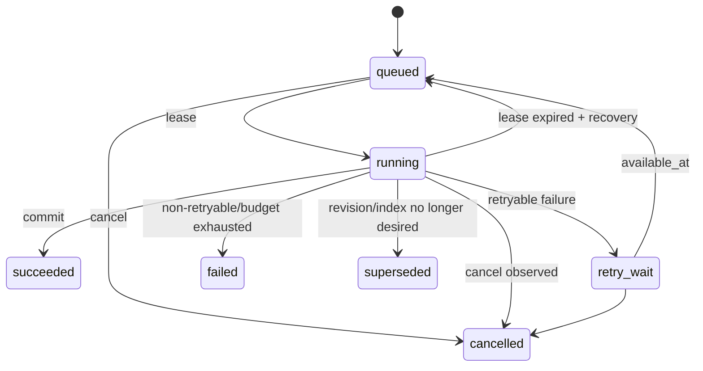

# TraceDesk API、权限与后台任务契约

## 1. API 总原则

- 新接口前缀 `/api/v1`；JSON 使用 UTF-8、RFC3339 UTC 时间、UUID 字符串。
- 所有写接口要求认证、授权、CSRF/Origin 校验和 `Idempotency-Key`（上传可由客户端生成 UUID）。
- 资源不存在与无权访问默认都返回 404，避免 ID 枚举；只有用户已知资源但动作权限不足时可 403。
- 错误统一：
```json
{
  "error": {
    "code": "INDEX_NOT_READY",
    "message": "当前知识库索引尚未就绪。",
    "request_id": "req_...",
    "retryable": true,
    "details": {}
  }
}
```
- 列表默认 `limit=50`，最大 200，cursor 分页；不使用大 offset。
- 服务端所有超时/取消产生可观察终态，不能返回“成功但后台未知”。

## 2. 认证与会话

### POST `/api/v1/auth/login`
请求：`{"email":"...","password":"..."}`。成功 204 并设置 Secure/HttpOnly/SameSite Cookie；响应体不返回 session token。失败统一 401，不区分邮箱是否存在。登录失败有速率限制和审计。

### POST `/api/v1/auth/logout`
撤销当前 session，204。

### GET `/api/v1/me`
返回用户、workspace membership 和可见 KB 摘要，不返回密码/hash。

管理员创建用户/重置密码是显式管理 API；首个管理员由一次性 bootstrap token 初始化。若未来 OIDC，登录接口可替换，但 `/me` 和授权模型不变。

## 3. 知识库与成员

- `GET /api/v1/workspaces/{workspace_id}/knowledge-bases`
- `POST /api/v1/workspaces/{workspace_id}/knowledge-bases`
- `GET /api/v1/knowledge-bases/{kb_id}`
- `PATCH /api/v1/knowledge-bases/{kb_id}`
- `GET/PUT/DELETE /api/v1/knowledge-bases/{kb_id}/members/{user_id}`

成员变更后 `user.auth_version` 或 KB `permission_epoch` 增加。所有在途查询在返回前比较 epoch；变化则丢弃正文并返回 `AUTHORIZATION_CHANGED`。

## 4. 文档接口

### POST `/api/v1/knowledge-bases/{kb_id}/documents`
multipart：`file`、`display_name?`。Header `Idempotency-Key`。  
成功不是“索引完成”，返回 202：

```json
{
  "document_id":"uuid",
  "revision_id":"uuid",
  "job_id":"uuid",
  "state":"queued",
  "duplicate":false
}
```

相同 idempotency key + 相同 payload 返回同结果；相同 key + 不同 payload 返回 409 `IDEMPOTENCY_CONFLICT`。

### GET `/api/v1/knowledge-bases/{kb_id}/documents`
cursor 分页；返回 logical document、active/desired revision、parse/index 状态。

### DELETE `/api/v1/documents/{document_id}`
需要 editor；Body `{"reason":"...","purge_after_days":7}`。返回 202 + GC job。重复删除幂等。删除事务先 tombstone 和 epoch++，再取消任务。

### GET `/api/v1/document-revisions/{revision_id}/source?page=1`
只有拥有 KB viewer 权限才能取。返回解析页，不直接暴露文件系统路径。

### GET `/api/v1/legacy/sources/{legacy_doc_id}`
迁移兼容。若仍存在返回 302/JSON alias；若已物理删除返回 410，不能指向同名新文档。

## 5. 索引接口

### POST `/api/v1/knowledge-bases/{kb_id}/index-generations`
Body：
```json
{"model_profile_id":"uuid","retrieval_profile":"default-v1","force_rebuild":false}
```
返回 202 job/generation。相同 corpus manifest + model profile + config hash 可复用 ready generation。

### GET `/api/v1/index-generations/{id}`
返回 `building/ready/active/superseded/failed`、chunk count、model digest、错误、进度。

### POST `/api/v1/index-generations/{id}/activate`
一般由 worker 自动调用内部 service；管理员手动激活必须重新验证 manifest，不允许激活 failed/不完整 generation。

## 6. 查询接口

### POST `/api/v1/queries`
请求：
```json
{
  "knowledge_base_id":"uuid",
  "question":"如何配置服务端口？",
  "profile":"evidence|ollama",
  "method":"bm25|dense|hybrid",
  "conversation_id":"uuid|null"
}
```

默认同步返回短查询；若模型队列预计等待超过 2 秒或客户端请求 `Prefer: respond-async`，返回 202 `query_job_id`。第一阶段可统一 async，前端轮询/SSE；不能让长生成占 Web worker。

同步 200 示例：
```json
{
  "query_id":"uuid",
  "status":"answered",
  "scope":{"kb_id":"uuid","data_epoch":42,"index_generation_id":"uuid"},
  "claims":[{"text":"...","citations":[{"chunk_id":"uuid","quote":"..."}]}],
  "sources":[...],
  "warning":null,
  "timing":{"queue_ms":0,"retrieval_ms":120,"generation_ms":3300,"total_ms":3600}
}
```

状态：`answered / evidence_found / no_evidence / needs_scope / clarify / partial / failed / cancelled`。`partial` 只用于技术性部分结果（例如已返回检索证据但模型失败），不能把“必要事实缺失”伪装为部分正确答案；当前整问拒答策略可继续。

### 权限撤销
查询开始保存 `auth_version`、KB `permission_epoch`、`data_epoch`。在读取来源、生成前、返回/导出前至少复核一次。撤权后：
- 在途模型调用可尽力取消；
- 已生成但未返回的正文丢弃；
- query_run 只保留安全审计元数据，普通用户不能读取；
- trace/source/export 均拒绝。

## 7. Trace、导出和评测

- `GET /api/v1/queries/{query_id}`：仅本人或管理员且仍有 KB 权限。
- `GET /api/v1/queries/{query_id}/trace`：同上；不返回模型隐藏思维链。
- `GET /api/v1/queries/{query_id}/export.md`：每次导出重新鉴权并写 audit。
- `POST /api/v1/evaluation-runs`：仅管理员/评测角色；真实 holdout 可设置 `sealed=true`，普通开发者不能通过 API 读取答案字段。

## 8. 任务 API

- `GET /api/v1/jobs/{job_id}`
- `POST /api/v1/jobs/{job_id}/cancel`
- `GET /api/v1/jobs?kb_id=&state=&cursor=`
- 内部 worker 不经公网 HTTP 领取任务，直接 DB repository。

任务响应：
```json
{
  "id":"uuid",
  "type":"parse_document",
  "state":"running",
  "progress":{"current":12,"total":100,"unit":"pages"},
  "attempt":1,
  "created_at":"...",
  "started_at":"...",
  "heartbeat_at":"...",
  "cancel_requested":false,
  "error":null
}
```

前端必须区分：
- queued：排队中，可取消；
- running：运行中，显示阶段/心跳；
- retry_wait：失败后等待重试，显示第几次；
- failed：最终失败，给稳定错误码和建议；
- cancelled：取消完成；
- superseded：被新 revision/index 替代；
- succeeded：完成；
- expired_index：不是 job state，而是资源状态；UI 提示重建。

## 9. 任务状态机



### 领取
短事务：
```sql
SELECT id
FROM jobs
WHERE state='queued' AND available_at<=now()
ORDER BY priority DESC, created_at
FOR UPDATE SKIP LOCKED
LIMIT 1;
```
随后 `UPDATE state='running', lease_owner=?, lease_expires_at=now()+interval '30 seconds'` 并提交。执行时不持锁。

### 心跳/租约
默认 lease 30s，heartbeat 10s。任务预期长步骤必须每≤10s 更新一次。worker 崩溃后 lease 到期，由 recovery 将任务重新 queued；attempt_count++。lease 值由 M8 故障测试校准。

### 重试预算
- 网络/模型 5xx/临时 DB 连接：最多 2 次重试，指数退避 5s/30s；
- 解析格式错误、超限、权限、schema 错：不重试；
- OOM/timeout：默认不自动无限重试；一次降低 batch 的受控重试可由任务类型显式实现并记录参数变化。
任何重试都生成 job_attempt；不能覆盖首次失败。

### 幂等提交
worker 的结果写入非 active revision/generation；最终事务验证：
- job 仍 running 且 lease_owner 相同；
- cancel_requested_at 为空；
- document 未 deleted；
- `logical_document.desired_revision_id == job.revision_id`；
- generation 的 corpus manifest 仍匹配。
否则标 `cancelled/superseded`，不激活。

### 取消竞争
取消只是设置 `cancel_requested_at`，不能假定立即杀死线程。worker 在 batch/page 边界检查；parse 子进程由 supervisor 发送 terminate，宽限 5s 后 kill。若“任务完成提交”和“取消”竞争，以同一事务的条件更新决定；只有成功 CAS 的一方成为终态。

## 10. 解析进程隔离

Web 只落原文件和创建 job。parse worker 再启动一次性子进程：
- 独立临时目录；
- 非 root/低权限用户；
- 默认墙钟 120s/文件、CPU 120s、内存 1.5GB、临时空间 2GB（Linux 使用 cgroup/container limit；Windows 开发环境用 Job Object/进程超时近似）；
- 不允许网络；
- 只读原文件，输出到临时 JSON/文本；
- supervisor 校验输出 schema/hash 后写 DB；
- timeout：TERM → 5s → KILL，wait/reap，删除临时目录；
- parser crash 不影响 Web/其他 worker。

这些数值是默认保护值，M8 根据 200 页正常 PDF 的 P99 调整。

## 11. 背压与限额

默认：
- 每用户同时 2 个 query job；
- 每 KB 同时 1 个 index generation；
- 全局生成并发 1（8GB GPU 起点）；
- parse 并发 2；
- queued query 最大 20、parse/index 最大 100；超过返回 429 `QUEUE_FULL`；
- 单用户每分钟查询 30、上传 10（管理员可调）。

限额命中必须有 `Retry-After`，并记录指标但不记录问题正文。

## 12. 旧 API 兼容

RC2 `/api/library /api/documents /api/ask /api/index /api/sources /api/traces` 在迁移期由 adapter 调 v1 service。团队模式下所有旧接口也必须认证；不允许因为“兼容”绕过 ACL。旧客户端无法表达异步 job 时，写接口可返回 409 `CLIENT_UPGRADE_REQUIRED`，而不是同步阻塞数分钟。
